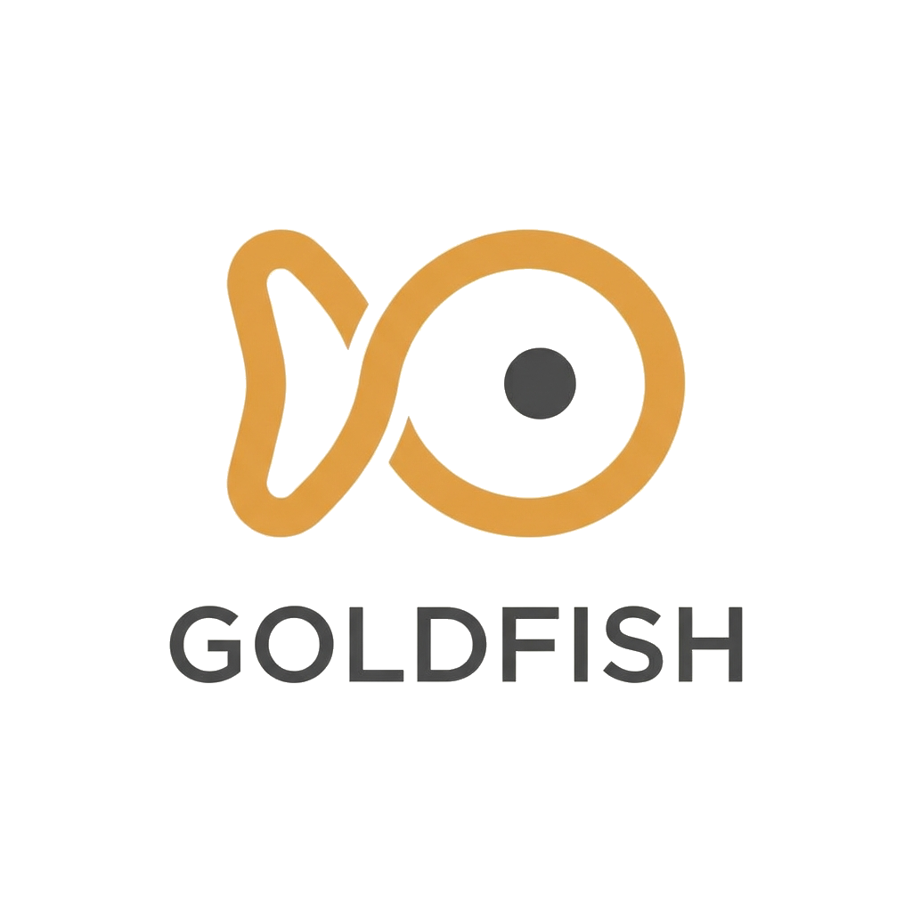

<p align="center">
  
</p>

<p align="center"><strong>A backbone for Agentic ML R&D</strong></p>

<p align="center">
  <a href="https://www.python.org/downloads/"></a>
  <a href="https://modelcontextprotocol.io/"></a>
  <a href="LICENSE"></a>
  <a href="https://github.com/lukacf/goldfish/actions"></a>
</p>

<br>

ML researchers invented attention—yes Jürgen, you too—and taught machines to write poetry, pass bar exams, and debug code. Software developers now ship faster with Copilot, Cursor, and Claude Code. But the researchers themselves? Dashboards from 2019 and "did I already try lr=3e-4?" The shoemaker's children are barefoot.

Why can't agents just do ML? We're asking too much—ML logic, infrastructure, AND tracking everything across context windows. They *goldfish*. Meanwhile, humans are terrible at the tedious parts (be honest: `model_final_FINAL_v2.pt`). But here's the thing: LLMs are actually great at documentation. Give them the right backbone and you get perfect recall without the tedium.

**Goldfish is that backbone.** Contract-based runs. Deterministic validation. AI-powered review. Everything documented automatically. It transforms a coding agent into a research assistant with perfect recall, infinite patience, and documentation you'd never write yourself.

<p align="center">
  <em><!-- TODO: Add demo video here --></em>
</p>

---

## Get Started

```bash
pip install goldfish-ml
cd your-ml-project
goldfish init
```

Connect your agent:

<table>
<tr>
<td><strong>Claude Code</strong></td>
<td><strong>Codex</strong></td>
<td><strong>Gemini CLI</strong></td>
</tr>
<tr>
<td>

```bash
claude mcp add goldfish \
  -- goldfish serve
```

</td>
<td>

```bash
# Add to .codex/config.json
"mcpServers": {
  "goldfish": {
    "command": "goldfish",
    "args": ["serve"]
  }
}
```

</td>
<td>

```bash
# Add to ~/.gemini/settings.json
"mcpServers": {
  "goldfish": {
    "command": "goldfish",
    "args": ["serve"]
  }
}
```

</td>
</tr>
</table>

---

## What Goldfish Does

Tools like W&B and MLflow weren't designed for agents. Goldfish is—built around their strengths (tireless, precise, great at documentation) and weaknesses (no persistent memory, no intuition for "normal").

| Feature | What it means |
|---------|---------------|
| **Memory that persists** | Every decision, result, and rationale is captured. After compaction, agents resume with full context—what they tried, why, and what to do next. |
| **Perfect provenance** | Every run is versioned before execution. Full lineage from raw data to final model. "What changed between v3 and v4?" is always answerable. |
| **Silent failure detection** | Deterministic checks catch shape mismatches, NaN propagation, and data leakage. AI review catches logic errors. Problems surface before they corrupt results. |
| **Institutional learning** | Failed experiments become searchable knowledge. Patterns are extracted, approved, and applied. The same mistake never happens twice. |
| **Instant comparison** | What made run B better than run A? Config diff, metric deltas, outcome tracking—all captured automatically, recallable instantly. |
| **One-line compute** | Write `profile: h100-spot` and run. Local Docker for iteration, GCE for cloud GPUs. Backend-agnostic design supports AWS, Azure, Kubernetes. |

---

## Architecture Deep Dive

### Immutable Provenance (Reproducibility by Default)
ML research is only as good as its reproducibility. Goldfish ensures that every result is tied to the exact code and configuration that produced it.
- **Copy-Based Isolation:** Agents work on ephemeral file copies in "slots" while versioning is enforced in a hidden git-backend.
- **Atomic Run-Commits:** Every `run()` call triggers an automatic sync and commit. You can rollback to any previous experiment state with 100% fidelity.
- **Data Lineage:** Full provenance tracking from raw datasets through features and models to final metrics.

### Multi-Phase Integrity Guard (Detecting Silent Failures)
Goldfish ends the "Garbage In, Garbage Out" cycle by enforcing rigorous data contracts and multi-stage verification:
- **Schema-Based Contracts (The Law):** Define strict expectations for signal geometry (shape, dtype) and distribution stats. Mechanistic checks catch "dead" datasets or collapsed distributions (e.g., sine-wave hallucinations) before they corrupt the pipeline.
- **Pre-Run AI Review:** Before execution, an AI agent reviews the entire workspace context—code, config, and git diff—to catch logic errors, missing imports, or hypothesis-code mismatches.
- **Runtime & Post-Run Verification:** Combines real-time health monitoring (loss/grad norm) with post-stage semantic review, where AI evaluates artifacts alongside their statistical profiles to ensure results align with the experimental intent.

### Transparent Compute Fabric (Hiding Infrastructure Hell)
Goldfish abstracts away "GCP compatibility matrix hell" and Docker plumbing so the agent can focus on science.
- **Multi-Backend Execution:** Seamlessly switch between Local Docker for iteration and GCE (H100/A100) for heavy training with a single command.
- **Resource Profiles:** Hardware constraints are managed via high-level profiles (`h100-spot`, `cpu-large`), preventing configuration drift.
- **Managed Storage:** Handles the complex bridging between GCS buckets and high-performance hyperdisks automatically.

### Narrative Context Recovery (Persistent Research Memory)
Experiments that last days shouldn't be lost when an agent's context window refreshes.
- **STATE.md Journaling:** Goldfish maintains a persistent, structured narrative of active goals, configuration invariants, and chronological research progress.
- **Orientation Recovery:** Agents call `status()` to instantly regain situational awareness, seeing active jobs, mounted workspaces, and recent findings.

---

## How It Works

Goldfish provides both a logical framework for research and a physical engine for execution.

### 1. Logical Research Flow (The DAG)
Experiments are organized as a Directed Acyclic Graph (DAG) of **Stages** and **Signals**, where every node is versioned and every edge is typed.

```text
┌─────────────────────────────────────────────────────────────────────┐
│                         WORKSPACE (The Lab)                         │
│                                                                     │
│   ┌─────────────────────────────────────────────────────────────┐   │
│   │                        PIPELINE (DAG)                       │   │
│   │    ┌──────────┐      ┌──────────┐      ┌──────────┐         │   │
│   │    │  STAGE   │      │  STAGE   │      │  STAGE   │         │   │
│   │    │preprocess│─npy─▶│  train   │─dir─▶│ evaluate │         │   │
│   │    └──────────┘      └──────────┘      └──────────┘         │   │
│   │         ▲                                    │               │   │
│   │         │           SIGNALS (Typed Flow)     ▼               │   │
│   │    ┌─────────┐                         ┌─────────┐          │   │
│   │    │ DATASET │                         │ METRICS │          │   │
│   │    └─────────┘                         └─────────┘          │   │
│   └─────────────────────────────────────────────────────────────┘   │
│                                                                     │
│   VERSION: v42 (Immutable Snapshot of Code + Config + Lineage)      │
└─────────────────────────────────────────────────────────────────────┘
```

### 2. Physical Orchestration (The Engine)
Goldfish manages the transition from local agentic code to isolated, containerized execution on high-performance cloud hardware.

```text
       USER ML PROJECT (Local)               GOLDFISH INFRA (Docker/GCE)
┌──────────────────────────────────┐      ┌──────────────────────────────────┐
│  WORKSPACE SLOT (w1, w2, ...)    │      │    CONTAINERIZED STAGE RUN       │
│  ┌────────────────────────────┐  │      │  ┌────────────────────────────┐  │
│  │  modules/train.py          │  │      │  │  [ isolated python env ]   │  │
│  │  configs/train.yaml        │──┼──────┼─▶│  goldfish.io.load_input()  │  │
│  │  pipeline.yaml             │  │      │  │                            │  │
│  └────────────────────────────┘  │      │  │     EXECUTE ML LOGIC       │  │
│               │                  │      │  │   (During-Run Health)      │  │
│               ▼                  │      │  │                            │  │
│    SVS PRE-RUN AI REVIEW         │      │  │  goldfish.io.save_output()  │  │
│    (Logic/Hypothesis Check)      │      │  └──────────────┬─────────────┘  │
│               │                  │      │                 │                │
└───────────────┼──────────────────┘      └─────────────────┼────────────────┘
                │                                           │
                ▼                                           ▼
      IMMUTABLE PROVENANCE                       MECHANISTIC SVS CHECK
     (Git-Backend + Version Tag)               (Shape/Dtype/Entropy/Nulls)
                │                                           │
                ▼                                           ▼
      CLOUD STORAGE (GCS) <──────────────────────> COMPUTE BACKEND (GCE)
      [ Datasets & Artifacts ]                  [ H100 / A100 GPU Nodes ]
```

### 3. Workspace & Provenance Engine (The Storage Layer)
Goldfish uses a **Copy-Based Isolation** model. Agents never touch the main project repository directly; instead, they work in ephemeral "slots" while Goldfish handles the versioning in a hidden backend.

```text
┌─────────────────────────────────────────────────────────────────────┐
│                 GOLDFISH DEV REPO (Internal Backend)                │
│      [ Manages all experiment branches, commits, and tags ]         │
│                                                                     │
│   branch: experiment/axial_attn  ────────────────────────┐          │
│   (Source of Truth)                                      │          │
└──────────────────────────────────────────────────────────┼──────────┘
          ▲                                                │
          │ (2) RUN: Atomic Sync + Commit                  │ (1) MOUNT:
          │     (Provenance Guard)                         │     Copy Files
          │                                                │
┌─────────┼────────────────────────────────────────────────▼──────────┐
│         │            USER ML PROJECT (Editing Slots)                │
│         └──────────  workspaces/w1/  <──────  Agent edits files     │
│                      (Plain files, no .git)                         │
└──────────────────────────────────┬──────────────────────────────────┘
                                   │
                                   ▼
                   (3) VERSION: axial_attn-v42
                   (Immutable git tag pinned to run SHA)
```

---

## Quick Start

### 1. Install Goldfish
```bash
git clone https://github.com/lukacf/goldfish.git
cd goldfish
pip install -e ".[dev]"
```

### 2. Initialize your Research Repo
Run this in the directory where your ML project lives:
```bash
goldfish init
```

### 3. Connect your AI Agent
Example with Claude Code:
```bash
claude mcp add goldfish -- uv run --directory /path/to/goldfish goldfish serve
```

---

## Documentation

| Document | Audience | Purpose |
|----------|----------|---------|
| [README.md](README.md) | Technical Humans | Evaluation, architecture, and value proposition. |
| [SKILL.md](.claude/skills/goldfish-ml/SKILL.md) | AI Agents | Comprehensive tool reference, schemas, and workflows. |
| [CLAUDE.md](CLAUDE.md) | AI Agents | Internal development guide and technical invariants. |
| [CONTRIBUTING.md](CONTRIBUTING.md) | Human Partners | Development environment and PR process. |
| [docs/GETTING_STARTED.md](docs/GETTING_STARTED.md) | Users | Installation and first run guide. |
| [docs/archive/CLOUD_ABSTRACTION.md](docs/archive/CLOUD_ABSTRACTION.md) | Developers | Cloud backend architecture and extension guide. |

---

## License
AGPL-3.0 — see [LICENSE](LICENSE) for details.
